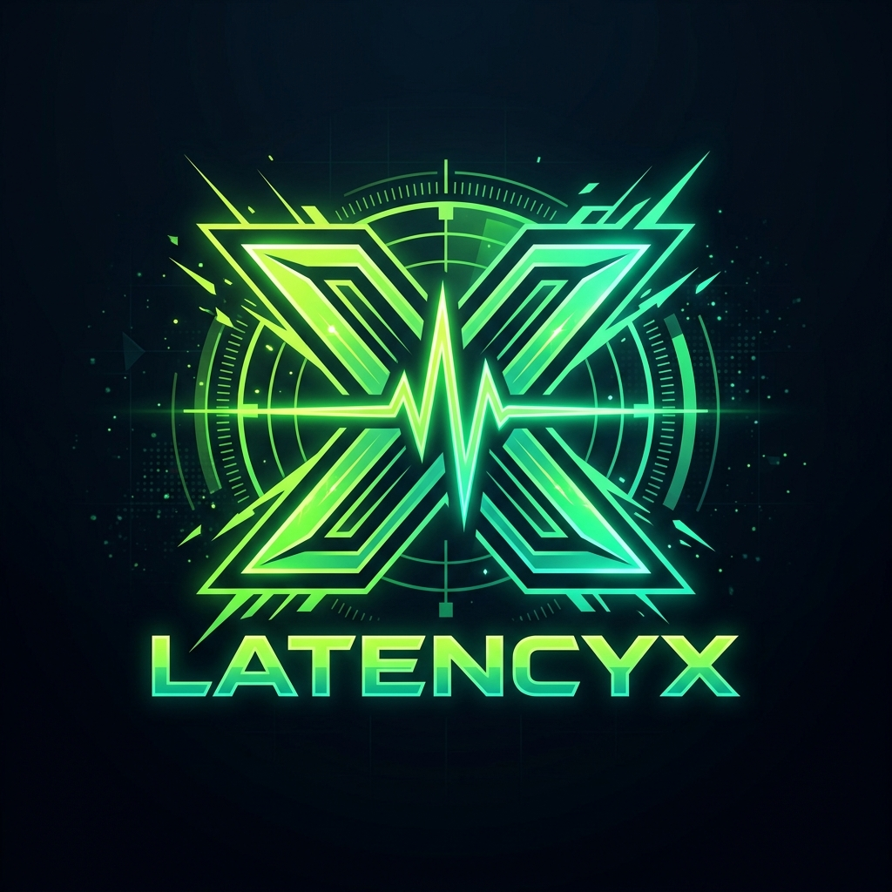

# LatencyX ⚡

> **Sri Lankan ISP Real-Time Game Server Latency & Network Diagnostics Platform**



LatencyX is a high-precision, client-side gaming network diagnostic tool built specifically for Sri Lankan competitive gamers. It auto-detects your ISP, measures outlier-filtered latency across global gaming servers, diagnoses router bufferbloat under active streaming load, and benchmarks DNS speeds using DNS-over-HTTPS.

---

## 🎯 Key Features

- **Precision Multi-Stage Latency Probing**:
  - **Pre-Warm Handshake**: Eliminates DNS & TLS 1.3 cold-start spikes.
  - **10% Trimmed Mean & Median (P50)**: Discards Wi-Fi and garbage collection spikes to report your true connection baseline.
  - **Peak Lag (P95)**: Highlights the worst 5% packet delay during competitive firefights.
  - **In-Game Netgraph Calibration (UDP)**: Estimates in-game socket latency matching Valorant, CS2, and Free Fire HUDs.
  - **RFC 3550 Standard Jitter**: Exponentially weighted packet-to-packet variance calculation.
  - **Esports Stability Index (0–100%)**: Evaluates match consistency.

- **11 Competitive Titles & 35+ Global Regions**:
  - Valorant, CS2, Dota 2, PUBG, Free Fire, Fortnite, Apex Legends, COD Warzone, League of Legends, Rocket League, EA FC 25.
  - Target regions: Mumbai (India), Singapore (SE Asia), Bahrain/Dubai (Middle East), Tokyo (Japan), Frankfurt (Europe).
  - Relevant subsea cable routing paths (SEA-ME-WE 3/5, BBG).

- **Sri Lankan ISP Auto-Detection**:
  - Auto-identifies SLT-Mobitel (Fiber / 4G / ADSL), Dialog Axiata (Home Broadband / 4G / 5G), Hutch 4G, and Airtel.
  - Displays public IP, ASN, and geographic region.

- **Bufferbloat & Traffic Load Diagnostic**:
  - Live 3-phase stress test: Unloaded baseline vs active download saturation vs active upload saturation.
  - Letter grade rating (A+ through F).
  - Specific router setup fixes for SLT GPON (192.168.1.1) and Dialog 4G (192.168.8.1).

- **Sri Lanka DNS Speed Benchmark**:
  - Compares Cloudflare (1.1.1.1), Google (8.8.8.8), AdGuard, and NextDNS via DoH against real game hostnames.
  - Includes a 1-click tutorial drawer for Windows 10/11 and router configuration.

- **Personal Test History & Diagnostics Log**:
  - 100% private, saved client-side in browser `localStorage` (no database required, zero tracking).
  - Filter by game, sort by newest or fastest ping.
  - One-click export to formatted `.csv` spreadsheets and raw `.json`.

---

## 🛠️ Tech Stack

- **Framework**: React 19 + Vite 8
- **Styling**: Vanilla CSS + Tailwind CSS v4 (Obsidian & Neon Lime Esports Theme)
- **Icons**: Lucide React
- **Network Engines**: Native Fetch API (no-cors), Performance Timing API, DNS-over-HTTPS (DoH)

---

## 🚀 Getting Started

### Prerequisites

- [Node.js](https://nodejs.org/) (version 18 or newer)
- npm or yarn

### Installation

1. Clone the repository:
   ```bash
   git clone https://github.com/YOUR_USERNAME/latencyx.git
   cd latencyx
   ```

2. Install dependencies:
   ```bash
   npm install
   ```

3. Start the local development server:
   ```bash
   npm run dev
   ```

4. Build for production:
   ```bash
   npm run build
   ```

---

## 🔒 Privacy & Performance

- **Zero Tracking**: No user data, IPs, or test logs are stored on remote servers.
- **Client-Side Architecture**: Pure static single-page application that can be hosted on Cloudflare Pages, Vercel, or Netlify at $0 cost.
